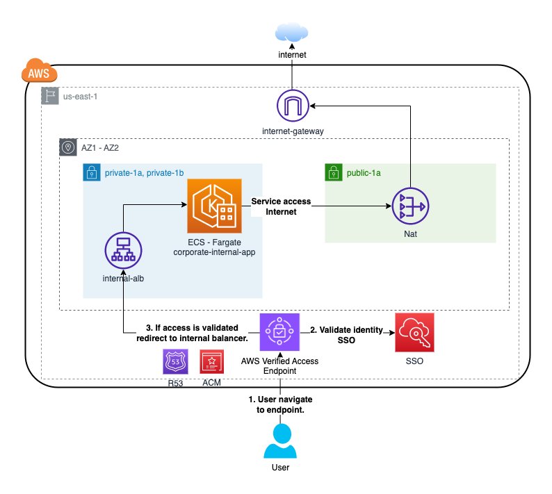

# AWS Verified Access implementation

aws cloudformation deploy --stack-name aws-verified-access-stack --template-file DeploymentStack.yaml --parameter-overrides VpcCidrBlock=10.20.0.0/16 --capabilities CAPABILITY_NAMED_IAM --profile sso-personal

sam deploy --stack-name aws-verified-access-stack --template-file DeploymentStack.yaml --capabilities CAPABILITY_NAMED_IAM --resolve-s3 --parameter-overrides VpcCidrBlock=10.1.0.0/16 --profile sso-personal
